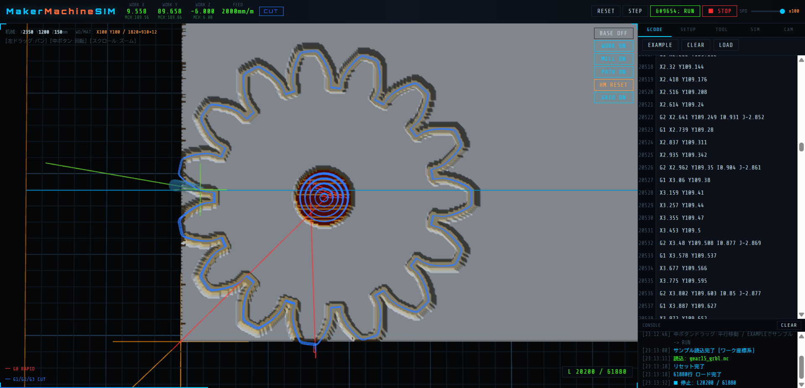

# MakerMachineSIM

WebGL製のブラウザで動くCNC Gコードシミュレーター。  
インストール不要。HTMLファイルをブラウザで開くだけで使えます。



---

## 特徴

- **ゼロインストール** — HTMLファイル1つ。ブラウザで開くだけ
- **WebGL 3Dビューポート** — パース/正投影切り替え、自由視点
- **ハイトマップ切削シミュレーション** — 刃物が通った部分をリアルタイムに彫刻表示
- **深さ色分け** — 未切削(グレー) → 浅切削(黄) → 深切削(オレンジ) → 突き抜け(赤)
- **6万行超のNCコードを高速処理**（差分更新・RAF描画分離による最適化）

---

## 使い方

### 基本操作

1. `index.html` をブラウザで開く（Chrome / Edge 推奨）
2. 右パネル **GCODE タブ** にGコードを貼り付け、またはファイルを読み込む
3. ヘッダーの **▶ RUN** ボタンで実行

### マウス操作

| 操作 | 動作 |
|---|---|
| 左ボタン ドラッグ | パン（平行移動） |
| 中ボタン ドラッグ | オービット（回転） |
| スクロールホイール | ズーム（カーソル位置中心） |

### ヘッダーボタン

| ボタン | 動作 |
|---|---|
| RESET | シミュレーションをリセット |
| STEP | 1行ずつ実行 |
| ▶ RUN / ⏸ PAUSE | 実行 / 一時停止 |
| ■ STOP | 停止 |
| SPD スライダー | 実行速度 1x 〜 100x |

### ビューポートボタン（右上）

| ボタン | 動作 |
|---|---|
| BASE ON/OFF | 機械テーブル表示切替 |
| WORK ON/OFF | ワーク材料表示切替 |
| MILL ON/OFF | エンドミル表示切替 |
| PATH ON/OFF | ツールパス表示切替 |
| GRID ON/OFF | グリッド表示切替 |
| HM RESET | ハイトマップのみリセット |

---

## 右パネル タブ説明

### GCODE タブ
- Gコードエディタ（直接入力 / ファイル読み込み）
- `EXAMPLE` ボタンでサンプルコード読み込み
- `LOAD` ボタンで `.nc` / `.gcode` / `.txt` ファイルを開く
- 実行中は現在行番号をビューポート右下に表示

### SETUP タブ
| 項目 | 説明 |
|---|---|
| MATERIAL SIZE X/Y/Z | 加工材料の寸法(mm) |
| WORK OFFSET X/Y | ワーク原点の機械座標(mm) |
| WORK OFFSET Z | 自動設定（材料厚み） |
| HM精度 | 1mm(高速) / 0.5mm(中精度) / 0.1mm(高精度) |

**座標系:**
```
機械Z=0   ── BASE(機械テーブル)天面
機械Z=+12 ── 材料天面 = G-code Z0（ワーク表面）
G-code Z=-3 → 材料に3mm切削
G-code Z<-12 → 突き抜け
```

### TOOL タブ
| 設定 | 選択肢 |
|---|---|
| 刃物径 | 数値入力(mm)、デフォルト 6mm |
| 刃物形状 | フラット / ボール / V90° / V60° |

M06で指定しなくても使用したいツールを選択すると、そのツールでシミュレーションされます。

### CAM タブ
- カメラ情報（方位角・仰角・ズーム倍率）
- 投影切替：**PERSP**（パース）/ **ORTHO**（正投影）
- プリセットビュー：TOP / FRONT / RIGHT / LEFT / ISO

---

## 対応 Gコード

### 移動コマンド

| コード | 説明 | パラメータ |
|---|---|---|
| `G0` | 早送り（ラピッド）移動 | X Y Z |
| `G1` | 直線切削 | X Y Z F |
| `G2` | 円弧切削（時計回り CW） | X Y Z I J / X Y Z R |
| `G3` | 円弧切削（反時計回り CCW） | X Y Z I J / X Y Z R |

**円弧パラメータ:**
```
I,J 指定: 始点からアーク中心へのオフセット（インクリメンタル）
R  指定: 円弧半径
         R+ → 180°以下の短弧
         R- → 180°超の長弧
         ※始点=終点のフル円はI,J指定を使用

例:
G2 X100 Y0 I50 J0        ; I,J指定
G2 X100 Y0 R50           ; R指定（短弧）
G3 X100 Y0 R-50          ; R指定（長弧）
G2 X0 Y0 I50 J0          ; フル円（始点=終点）
```

**モーダルGコード継続:**
```
G1 X100 Y100 F2000        ; G1 として実行
X200 Y150                 ; 直前の G1 を継続
G2 X100 Y0 R50            ; R指定（短弧）
X300 I10 J-5              ; 直前のG2 として実行
```

### 座標系・単位

| コード | 説明 |
|---|---|
| `G17` | XY平面選択（デフォルト） |
| `G20` | インチ単位 |
| `G21` | mm単位（デフォルト） |
| `G28` | 機械原点復帰 |
| `G54` | ワーク座標系1（認識のみ） |
| `G90` | アブソリュートモード（デフォルト） |
| `G91` | インクリメンタルモード |

### その他

| コード | 説明 |
|---|---|
| `G4 P[ms]` | ドウェル（停止）|
| `M3 S[rpm]` | スピンドル正転 |
| `M4 S[rpm]` | スピンドル逆転 |
| `M5` | スピンドル停止 |
| `M6 T[n]` | ツール交換 |
| `M0` / `M1` | プログラム停止 |
| `M2` / `M30` | プログラム終了 |

### コメント・対応フォーマット

```gcode
; セミコロン以降はコメント
(括弧内もコメント)

対応ファイル拡張子: .nc / .gcode / .txt / .ncc
```

---

## 機械スペック（デフォルト設定）

| 項目 | 値 |
|---|---|
| 機械テーブル | X 2350mm × Y 1200mm|
| ワーク材料（デフォルト） | X 1820mm × Y 910mm × Z 12mm |
| ワーク原点（デフォルト） | X100 Y100（機械座標） |
| 刃物径（デフォルト） | 6mm フラット |

---

## 動作環境

| ブラウザ | 対応状況 |
|---|---|
| Chrome 90+ | ✅ 推奨 |
| Edge 90+ | ✅ 推奨 |
| Firefox 88+ | ✅ 動作確認済み |
| Safari 15+ | ⚠️ 一部制限あり |

**要件:** WebGL 1.0 対応ブラウザ

---

## ファイル構成

```
CNCSIM/
└── index.html    # シミュレーター本体（全機能が1ファイルに集約）
```

---

## 今後の予定

- [ ] WebWorker によるバックグラウンドHM計算
- [ ] Tauri によるデスクトップアプリ化（EXE配布）
- [ ] サブプログラム（M98/M99）対応
- [ ] 加工時間・切削距離の表示
